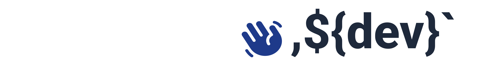

</a>

  
<h1 style="border-bottom: none" align="center"> Olá!, eu sou <strong style="border-bottom: none">Pedro</strong></h1>

## **EN**

 I am a Fullstack developer specializing in TypeScript, Nest, React, Node, and Next technologies. With a passion for building scalable and efficient web applications, I am constantly learning and honing my skills to provide high-quality solutions for my clients.

## **PT-BR**

 Sou um desenvolvedor Fullstack especializado em tecnologias TypeScript, Nest, React, Node e Next. Com uma paixão pela construção de aplicativos web escaláveis e eficientes, eu estou constantemente aprendendo e aprimorando minhas habilidades para fornecer soluções de alta qualidade para meus clientes.

  <a href="#">
   
  
  </a>

## **EN**

 In addition to infrastructure and development, I have experience e curius in implementing continuous integration and continuous deployment (CI/CD) pipelines using Jenkins and Docker. I believe that automation is key to achieving reliable and efficient software delivery, and I am constantly learning and improving my skills in this area.

 
## **PT-BR**

 Além de infraestrutura e desenvolvimento, tenho experiência e curiosidade na implementação de pipelines de integração contínua e implantação contínua (CI/CD) usando Jenkins e Docker. Acredito que a automação é a chave para alcançar a entrega de software confiável e eficiente, e estou constantemente aprendendo e aprimorando minhas habilidades nessa área.

  <a href="#">
   
  
  </a>

## **EN**

Thank you for visiting my GitHub profile! If you are interested in collaborating on a project or have any questions, please don't hesitate to reach out.

 
## **PT-BR**

Obrigado por visitar meu perfil do GitHub! Se você estiver interessado em colaborar em um projeto ou tiver alguma dúvida, não hesite em entrar em contato.

 

  
    